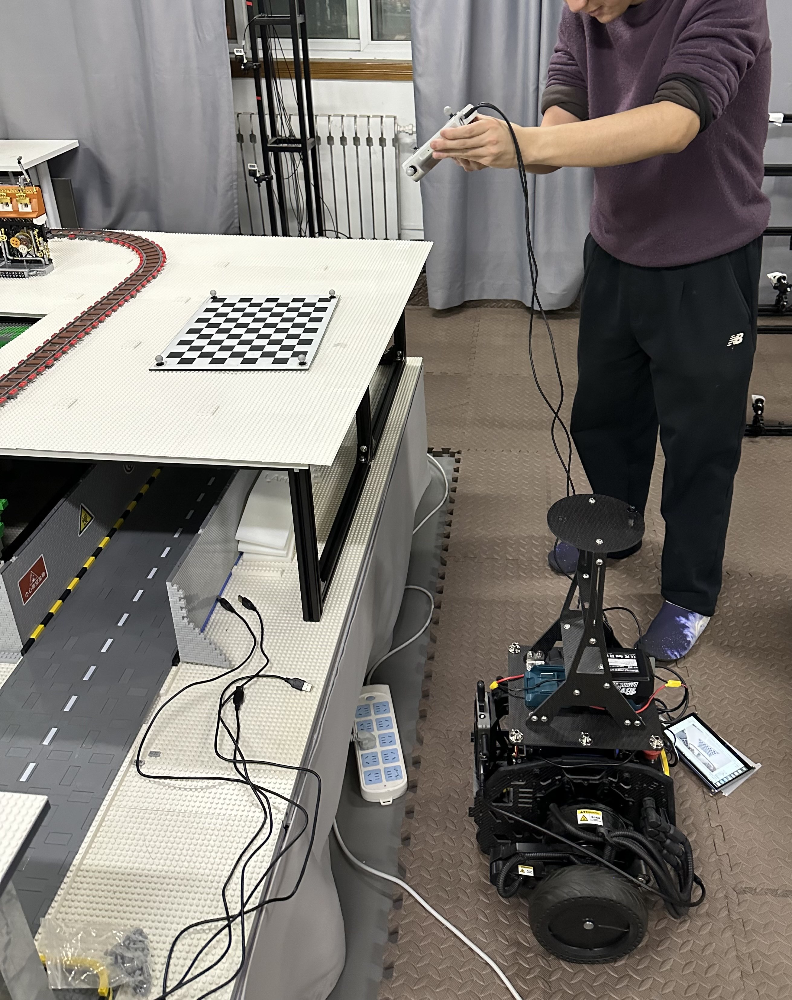

# mocap_cam_handeye_calibration

Coordinate handeye calibration between motion capture and RGBD camera

## Data collect

You need an RGBD camera (or just an RGB camera, depth is optional, as it is not required for calibration) and a motion capture device that provides accurate pose information. In this case, we use OptiTrack's motion capture solution, which provides rigid body poses described by quaternions (w, x, z, y) and translations (x, z, y) in a right-handed coordinate system. Additionally, attach motion capture markers to the camera to obtain its pose.

Next, based on a robotics system such as ROS2, write code to record the camera's captured images and the corresponding rigid body poses in real time. Remember, timestamp synchronization is critically important in calibration tasks.

> You can find an example ROS2-based project for recording calibration datasets in `./ref_code/rosbag_image_save` within this project.

Next, as shown in the figure, you need to slowly move the camera around while pointing it at the checkerboard (in our case, a 9x12 checkerboard with a square size of 0.03m). The camera should be as close to the checkerboard as possible. During this process, the dataset recording program will simultaneously log the camera's RGB images, depth images, and the poses provided by the motion capture system (which can also be considered the position of the "hand" in "hand-eye calibration").



The collected example dataset can be found in the `./example_dataset/` folder. For simplicity, we have only retained the first 30 images as a sample. In practice, you should collect as many images as possible to minimize the final error. We recommend at least 200 multi-view images and advise avoiding motion blur in the images as much as possible.

## Instruction of calibration

### 1. Convert quat.txt to RT.txt

Modify `0_quat_to_rt.py`, change 

```python
input_file = "./dataset/calibrate/calibrate1_8_2/pose_quat.txt"
```
to your own dataset path

and

```bash
python 0_quat_to_rt.py
```

this should generate `.<same_path_as_quat_file>/pose_rt.txt`

### 2. Generate Json Dataset Description File From Dataset Folder

Modify `1_gen_dataset_all.py`, change 

```python
dataset_path = "./dataset/calibrate/calibrate1_8_2"

IMAGE_COUNT = 222
```

to your own dataset path, and your count of images

and

```bash
python 1_gen_dataset_all.py
```

this should generate `dataset.json`

### 3. Detect Checkerboard Corners and Solve Camera Pose

In this step, if you know the precise intrinsic parameters of your RGB camera, you can run `2_detect_cam_pose_with_know_intrinsics.py` and modify the intrinsic parameters defined in the script. If you do not know your camera's intrinsic parameters, you can run `2_detect_cam_pose.py`, which will automatically calculate reasonably accurate intrinsic parameters based on the checkerboard corners.

Remember both file need to modify:

```python
    XX = 11 
    YY = 8 
    L = 0.03
```

to your own checkboard parameters (in our case, a 9x12 checkerboard with a square size of 0.03m)

Both of the scripts can generate `calibrated_dataset.json`, and if your choice if `2_detect_cam_pose.py`, there will be an extra file called `calibration_result.json` which stores the estimated camera parameters. This estimation can be used if the following step if you don't know the accurate intrinsic parameters of your camera.

### 4. Perform hand-eye calibration using these dataset

Run:

```bash
python 3_solve_RT.py
```

this will read `calibrated_dataset.json` and perform hand-eye calibration by using OpenCV lib

this will generate hand-eye calibration result: `hand_eye_calibration_result.npz`

### 5. (Optional) Verify the result when DepthImage Available

If you are using RGBD camera, then you can easily verify your result by executing:

```bash
python 4_verify_result_with_o3d.py
```

Remember to modify the code:

```python
FX = 607.88
FY = 607.966
CX = 641.875
CY = 365.585

DEPTH_SCALE = 1000.0

DEPTH_TRUNC = 2.0
```

if you know the accurate camera intrics, you can directly modify the value here

if you don't know, just read the value from step 3, there will be an extra file called `calibration_result.json` which stores the estimated camera parameters

this script will open an interactive window showing the result pointcloud, and will also save the final pointcloud to file `final_map.pcd`

